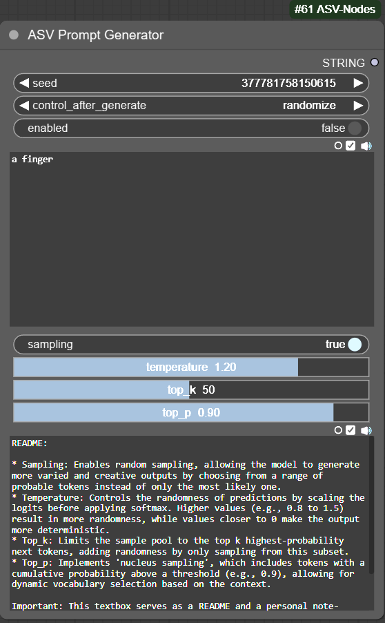

# ComfyUI-ASV-Nodes

## Overview

The ComfyUI Prompt Generator is inspired by simplifying the process of creating prompts using the [superprompt-v1](https://huggingface.co/roborovski/superprompt-v1) model. 

## Installation

Just clone the repo (https://github.com/zubenelakrab/ComfyUI-ASV-Nodes) into your custom_nodes directory.

## Available Options
* Enabled: Enable or disable prompt generation (If disabled text is sent as prompt).
* Sampling: Enables random sampling, allowing the model to generate more varied and creative outputs by choosing from a range of probable tokens instead of only the most likely one.
* Temperature: Controls the randomness of predictions by scaling the logits before applying softmax. Higher values (e.g., 0.8 to 1.5) result in more randomness, while values closer to 0 make the output more deterministic.
* Top_k: Limits the sample pool to the top k highest-probability next tokens, adding randomness by only sampling from this subset.
* Top_p: Implements 'nucleus sampling', which includes tokens with a cumulative probability above a threshold (e.g., 0.9), allowing for dynamic vocabulary selection based on the context.

## Updates
11/04/2024 - Added enabled function. Cleanup.

## Credits

- Thanks to [roborovski](https://huggingface.co/roborovski) for create the model
 

